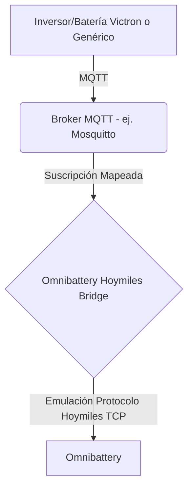

# Omnibattery Hoymiles Bridge

[](https://opensource.org/licenses/MIT)
[](https://www.home-assistant.io/)

Este repositorio contiene un middleware/puente agnóstico escrito en Python. Su objetivo es suscribirse a tópicos MQTT procedentes de cualquier sistema solar/batería (como Victron, inversores genéricos o contadores de red) y emular el comportamiento de un dispositivo de hardware Hoymiles a través de TCP/API.

Este puente está diseñado para funcionar perfectamente como **nexo de unión** con el gestor energético [Omnibattery](https://github.com/ffunes/Omnibattery), permitiendo a instalaciones de diferentes marcas ser controladas como si fueran sistemas Hoymiles (ej. MS-A2 o HiBattery).

## Arquitectura

El puente funciona manteniendo un estado en memoria. Por un lado, se actualiza mediante un cliente MQTT y, por otro, sirve estos datos mediante un servidor TCP (basado en los conceptos de [hoymiles-wifi](https://github.com/suaveolent/hoymiles-wifi)).



## Requisitos

- Un broker MQTT (ej. el Add-on Mosquitto de Home Assistant).
- Los datos de tu sistema solar publicados en tópicos MQTT.
- [Opcional] Entorno Home Assistant para instalar como Add-on local.

## Instalación

### Método 1: Como Add-on Local en Home Assistant (Recomendado)

1. En tu servidor de Home Assistant, navega a la carpeta `/addons`. (Puedes acceder mediante Samba Share, SSH o VSCode Add-on).
2. Clona este repositorio o copia la carpeta `omnibattery-hoymiles-bridge` dentro de `/addons`.
   ```bash
   cd /addons
   git clone https://github.com/abuawn/omnibattery-hoymiles-bridge.git
   ```
3. Ve a **Ajustes > Complementos** en Home Assistant.
4. Haz clic en **Tienda de complementos**, luego en el menú de los 3 puntos (arriba a la derecha) y selecciona **Comprobar actualizaciones**.
5. Busca "Omnibattery Hoymiles Bridge" al final de la lista, bajo "Local add-ons".
6. Instala el Add-on, configura las opciones en la pestaña **Configuración** y dale a **Iniciar**.

### Método 2: Standalone / Docker

Si no usas Home Assistant o prefieres Docker puro, puedes compilarlo tú mismo.

1. Clona el repositorio.
2. Edita `config.yaml` mapeando los tópicos MQTT a tu instalación.
3. Compila y ejecuta:
   ```bash
   docker build -t omnibattery-hoymiles-bridge .
   docker run -d --name bridge \
     -v $(pwd)/config.yaml:/usr/src/app/config.yaml \
     -p 10081:10081 \
     omnibattery-hoymiles-bridge
   ```

### Método 3: Python nativo

1. Clona el repositorio e instala dependencias:
   ```bash
   pip install -r requirements.txt
   ```
2. Edita `config.yaml`.
3. Ejecuta:
   ```bash
   python main.py
   ```

## Configuración

En la configuración (sea el archivo `config.yaml` o la UI de Home Assistant) deberás establecer:

- **Broker MQTT**: IP, puerto, usuario y contraseña.
- **Tópicos**: Deberás mapear exactamente en qué tópicos MQTT de tu instalación se publican variables como:
  - `battery > voltage`
  - `battery > power` (positivo carga, negativo descarga o viceversa)
  - `battery > soc` (%)
  - `grid > power_import` y `power_export`
- **Emulador**: `virtual_serial_number`, con el formato de serie de la unidad que desees emular, ej. `MSA-280024341346`.

## Agradecimientos y Atribuciones

Este proyecto actúa como puente entre dos grandes proyectos open source de la comunidad. Mis agradecimientos y todo el crédito por la ingeniería inversa y el desarrollo de gestión a:

- [ffunes/Omnibattery](https://github.com/ffunes/Omnibattery) - Por el sistema de gestión energética de destino.
- [suaveolent/hoymiles-wifi](https://github.com/suaveolent/hoymiles-wifi) - Por la librería de referencia y decodificación del protocolo Hoymiles.

## Licencia

Este proyecto está bajo licencia MIT. Ver archivo [LICENSE](LICENSE) para más detalles.
