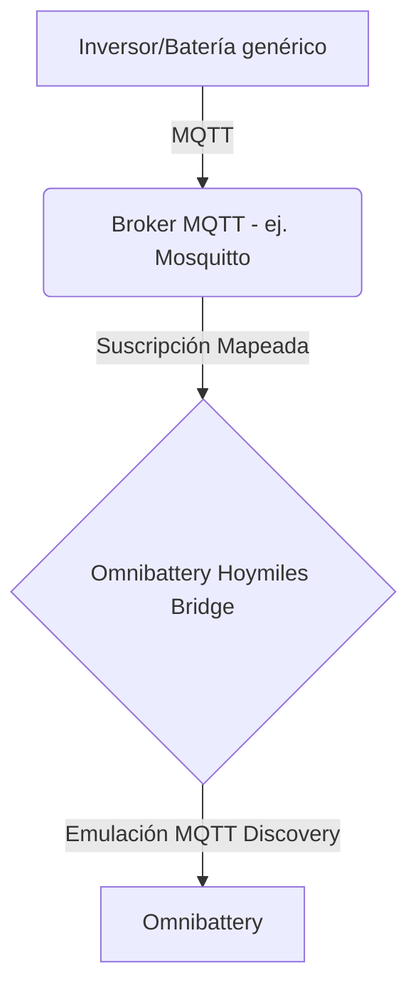

# Omnibattery Hoymiles Bridge

[](https://opensource.org/licenses/MIT)
[](https://www.home-assistant.io/)

Este repositorio contiene un middleware/puente agnóstico escrito en Python. Su objetivo es suscribirse a tópicos MQTT procedentes de cualquier sistema solar/batería y **emular el comportamiento de un dispositivo de hardware Hoymiles MS-A2 a través de MQTT Discovery**.

Este puente está diseñado para funcionar perfectamente como **nexo de unión** con el gestor energético [Omnibattery](https://github.com/ffunes/Omnibattery), permitiendo a instalaciones de diferentes marcas ser controladas o visualizadas como si fueran sistemas Hoymiles (ej. MS-A2 o HiBattery).

## Arquitectura

El puente funciona inyectando mensajes de Autodescubrimiento (MQTT Discovery) en el broker de Home Assistant. Esto provoca que Home Assistant y Omnibattery crean que existe una batería física Hoymiles conectada a la red. El puente se encarga de escuchar los datos reales de tu sistema y traducirlos en tiempo real al formato que espera Omnibattery.



## Instalación como Add-on de Home Assistant

1. Ve a **Ajustes > Complementos > Tienda de complementos**.
2. Haz clic en los tres puntos arriba a la derecha y selecciona **Repositorios**.
3. Añade la URL de este repositorio: `https://github.com/AbuAwn/omnibattery-hoymiles-bridge`
4. Busca "Omnibattery Hoymiles Bridge" e instálalo.
5. Inicia el Add-on y comprueba la pestaña de Registro (Logs).

## Configuración en Omnibattery

1. Asegúrate de que el Add-on está iniciado y conectado al MQTT (revisa los logs).
2. Ve a la configuración de Omnibattery en Home Assistant (Ajustes > Dispositivos > Añadir Integración > Omnibattery).
3. Selecciona la marca **Hoymiles MQTT**.
4. En el campo "ID de dispositivo MQTT", introduce exactamente: `MSA-280024341346` (Este es el número de serie virtual que genera el puente por defecto).
5. Completa la configuración.

## Configuración de Tópicos (Mapeo)

Para que el puente envíe datos reales a Omnibattery, debes configurar los `topics` en la pestaña **Configuración** del Add-on. 
Por defecto, viene configurado para leer de tópicos de ejemplo como `hoymiles/BATERIA_CASA_01/...`. 
Debes cambiar estas rutas por las rutas exactas donde tu sistema publica la información en tu broker MQTT.

Ejemplo de configuración:
```yaml
mqtt:
  broker: core-mosquitto
  port: 1883
  username: tu_usuario_mqtt
  password: tu_password_mqtt
topics:
  battery:
    power: "hoymiles/BATERIA_CASA_01/state/power"
    soc: "hoymiles/BATERIA_CASA_01/state/soc"
    voltage: "hoymiles/BATERIA_CASA_01/state/voltage"
    temperature: "hoymiles/BATERIA_CASA_01/state/temperature"
```
